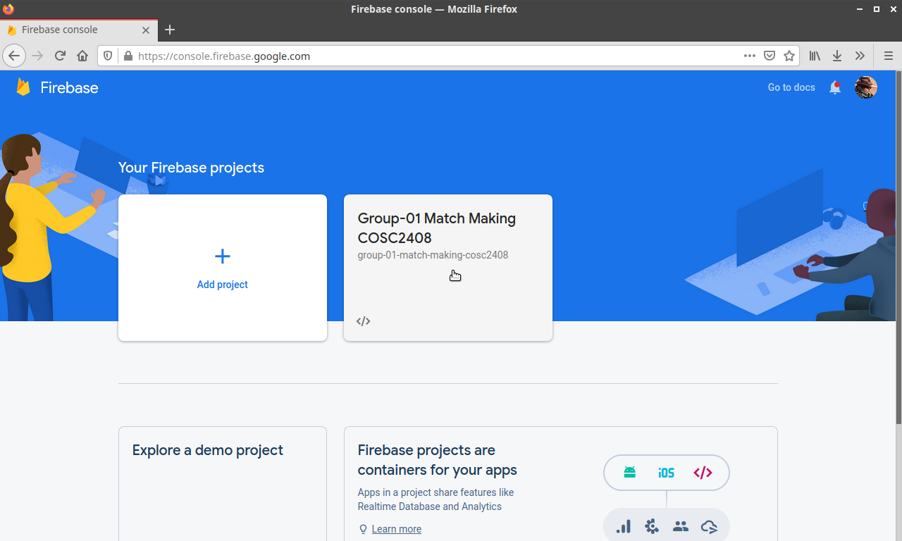
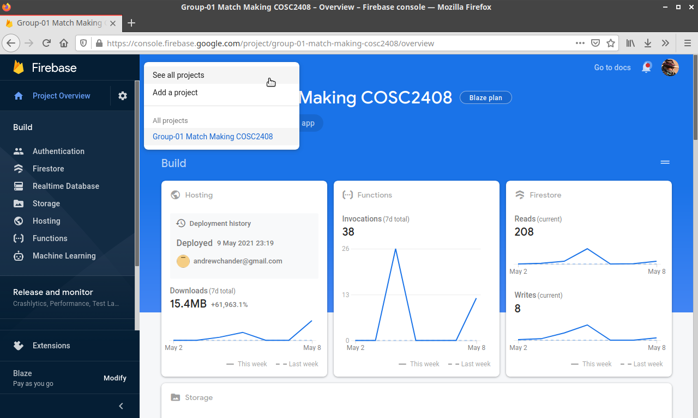

# PBI 12 - An Admin should be able to login and logout of a registered account

## 12.1 Administrator can login

The following steps assume that the administrator is already logged into their google account.

1. Ensure that you are logged into your Google account and head to <https://console.firebase.google.com/>.
2. Select the project that contains the EasyRecruit deployment.

## 12.2 Administrator can logout

1. To leave the Firebase project overview, click on the project name at the top of the screen and select **See all projects**.

