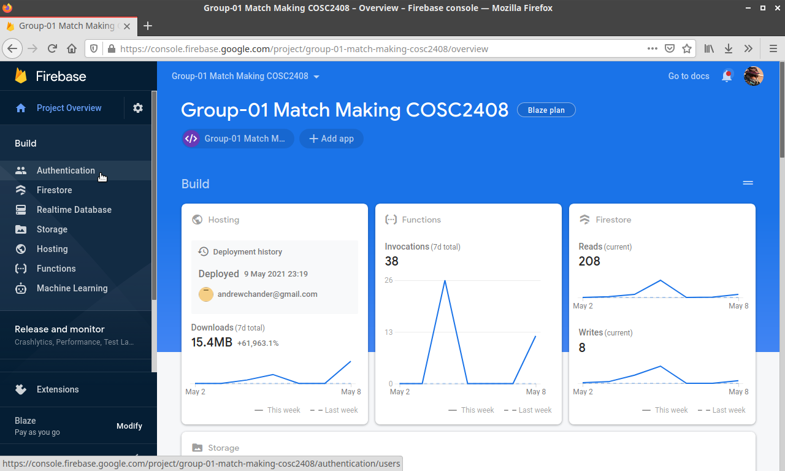
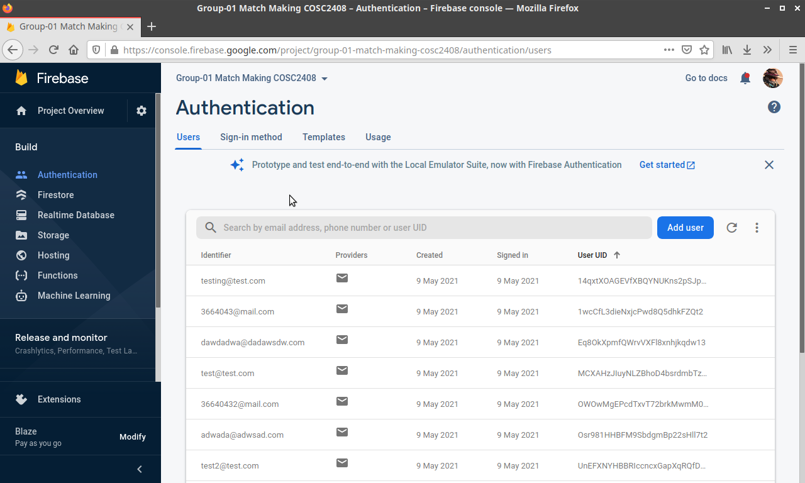
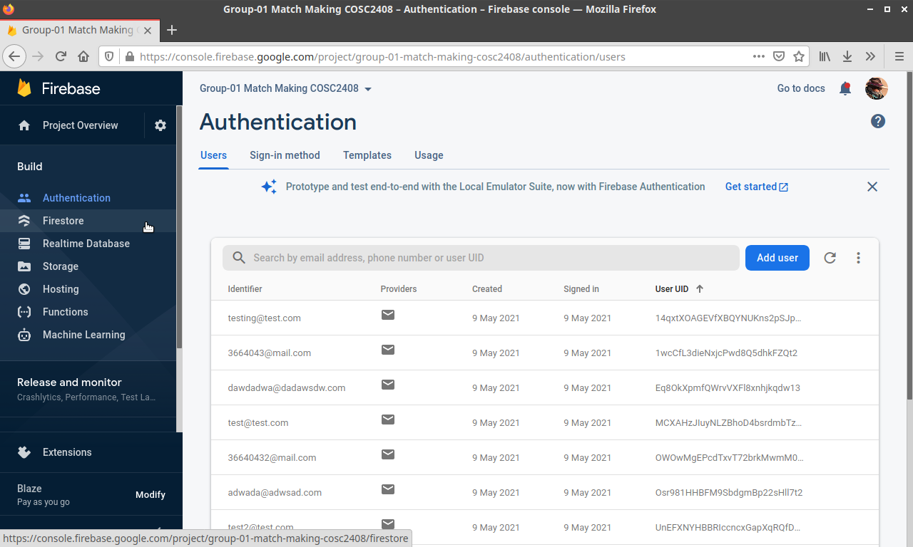
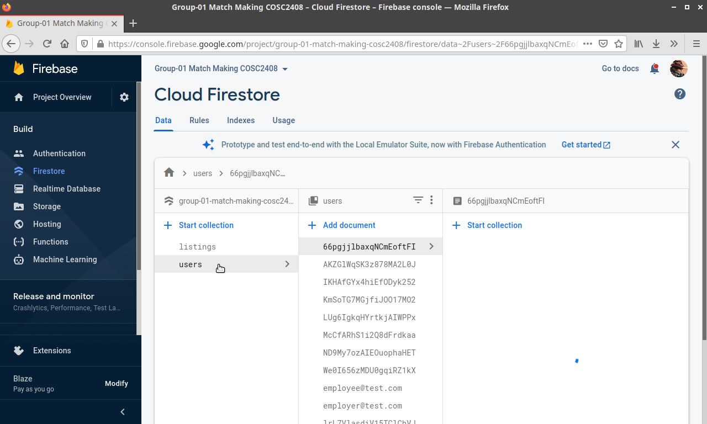
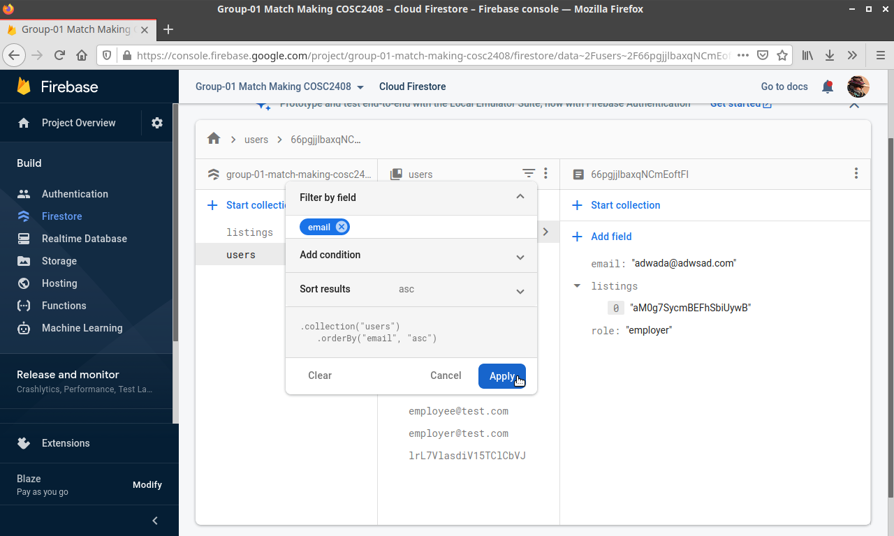
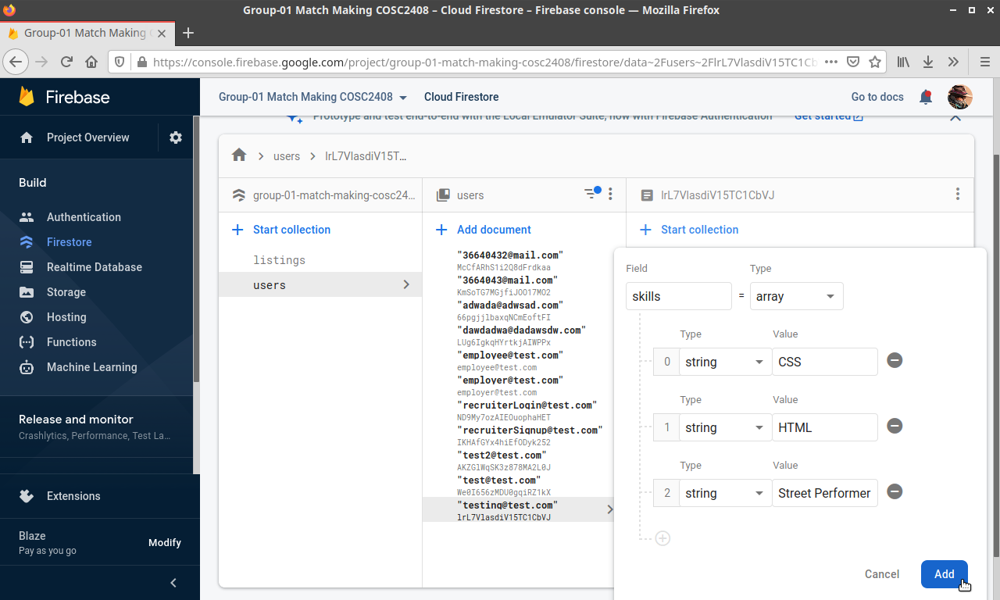
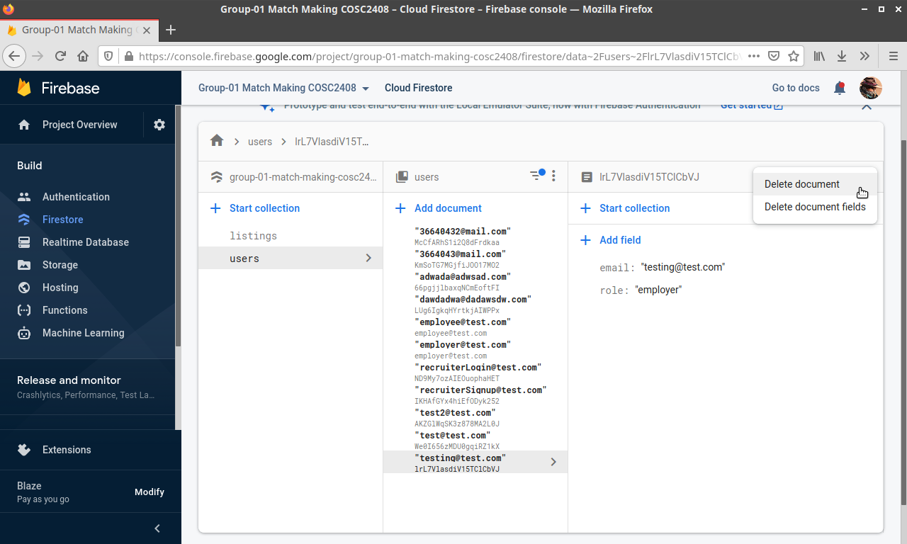

# 13 - An admin should be able to view, edit and delete all registered users

## 13.1 Adminstrator can view, edit and delete all users

### 13.1.1 Firebase Authentication users

The following steps assume the administrator is on the project overview.

1. On the left, click on Authentication.

2. Once loaded, the administrator will be able to see all the users sign-in emails.

3. To delete a users ability to sign in, hover over the desiered user, click on the 3 dots menu and click **Delete Account**.

Firebase Authenticationd oes not give administrators the ability to edit login emails, it can only reset passwords, disable accounts, and delete accounts. This is anot a limitation, this is by design by Google.

Please note that this removes a user's *ability* to login. It does not remove the user's data that are stored in Firebase Firestore.

### 13.1.2.1 View Firestore Firebase user data

To view user data, the following steps can be taken.

1. On the left panel, click on Firestore.

2. Once the firestore has loaded, select the **users** collection.

3. Users data documents are given unique identifiers when saved to the Firestore. To make the search for a user easier, when we filter by email. Click the upside down triangle burger menu and enter "email" into the **Filter by Field**. Then click apply.

The user data for <testing@test.com> will be used for the remaining features.

### 13.1.2.2 Edit Firebase Firestore user data

To edit user data, click **Add Field** and add in any type of data desired. For this example we will be adding some skills to the user.

1. Click **Add Field**
2. From this menu, enter "skills" into **Field** and change **type** to **Array**.
3. Then add a list of skills.

4. Once done, click **Add** and youwill be able to view the newly added skills. This data - if entered correctly - will also show on the web application is this user logs in a view thieir profile.

### 13.1.2.3 Delete Firebase Firestore user data

1. To delete specific user data, first hover over the desired data and click the delete button.

2. To delete the user data, select the document, then on the right select the 3 dots menu and click **Delete Document**, then **start delete**.

