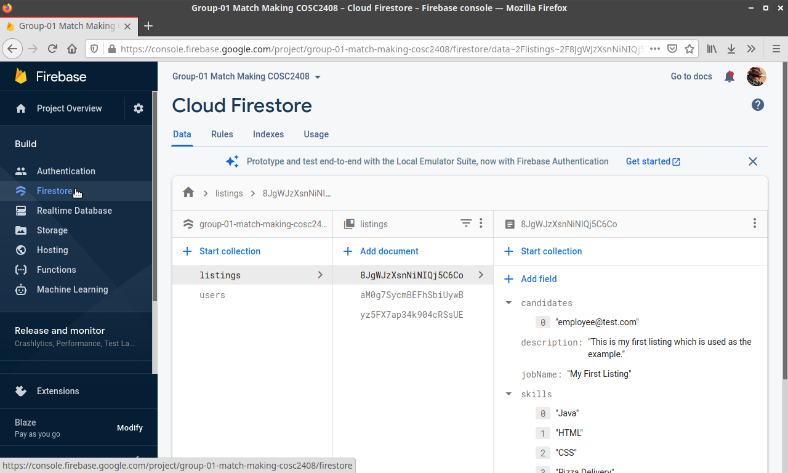
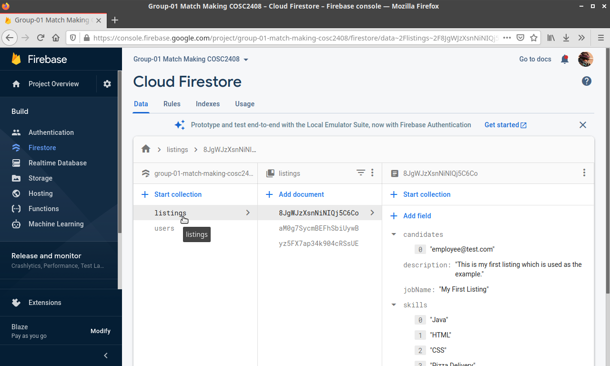
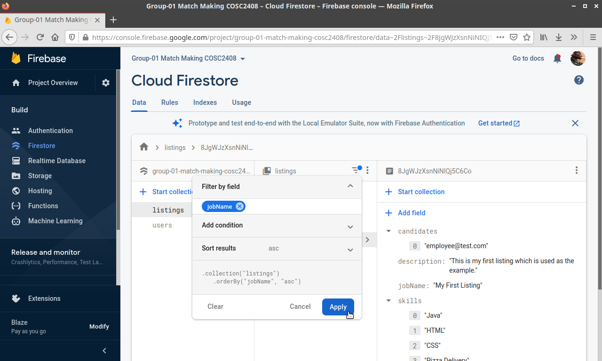
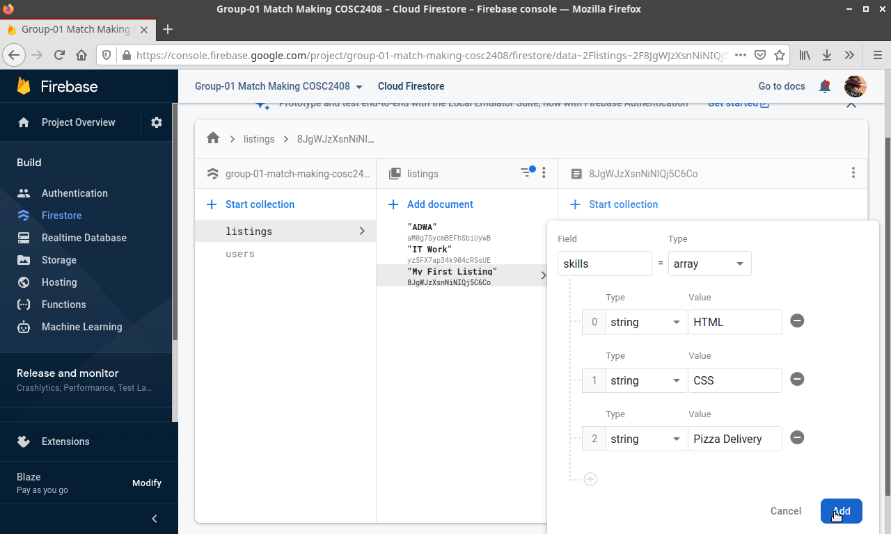
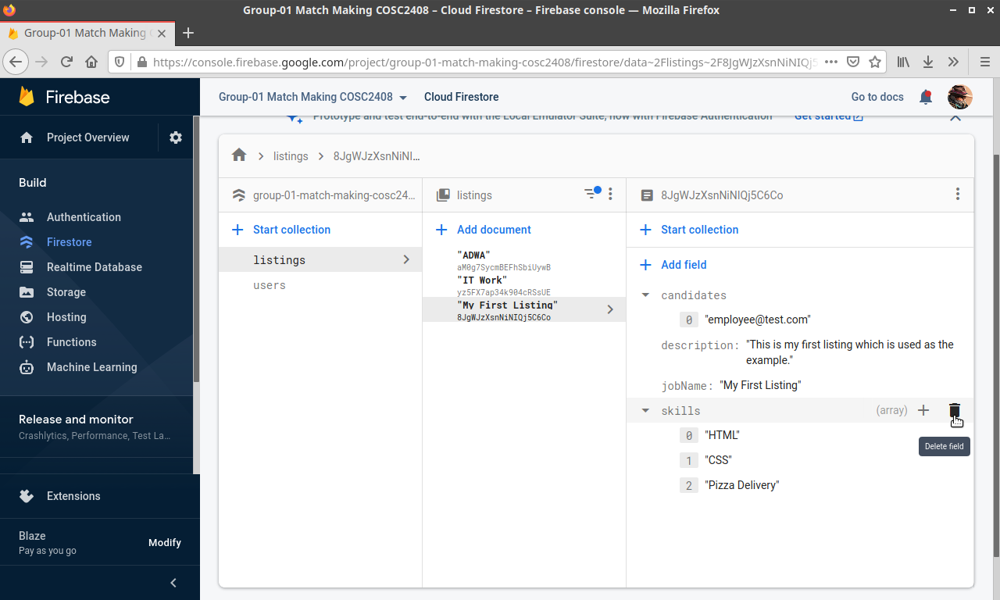
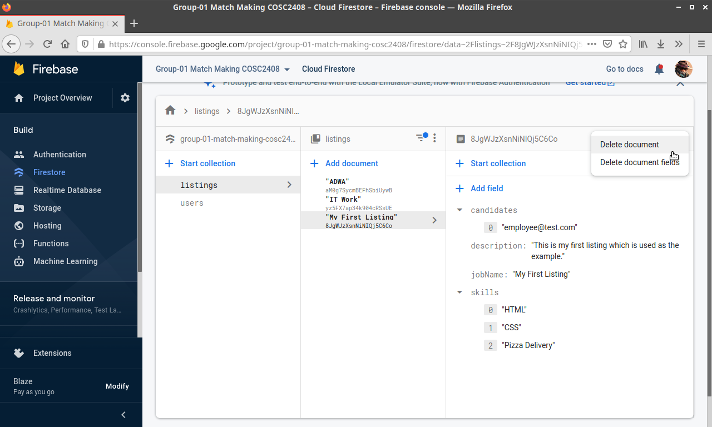

# 15 - An Admin should be able to view, edit and delete all job specifications

## 15.1 Administrators can view, edit and delete all listings

### 15.1.1 Firestore Firebase listings

1. On the left tab, click on Firestore.

2. Once the Firestore has loaded, select the **listings** collection.

3. Listing data documents are given a unique identifier when saved to the Firestore. TO make the search for a listing easier, we can filter by job name. Click the upside down triangle burger menu and enter "jobName" into the **Filter by Field**. Then click apply.

The listing data for "My first listing will be used for the remaining features.

### 15.1.2 Edit Firebase Firestore listing data

To edit listing data, click **Add Field** and add in any type of data desired. For this example we will be adding some skills to the listing.

1. Click **Add Field**.
2. From this menu, enter "skills" into the **Field** and change **type** to **Array**.
3. Then add a list of skills.

4. Once done, click **Add** and you will be able to view the edited skills.

### 15.1.3 Delete Firebase Firestore listing data

1. To delete specific listing data, first hover over the desired data and click the delete button.

2. To delete the listing data, select the document, then on the right select the 3 dots menu and click **Delete Document**, the **start delete**.

